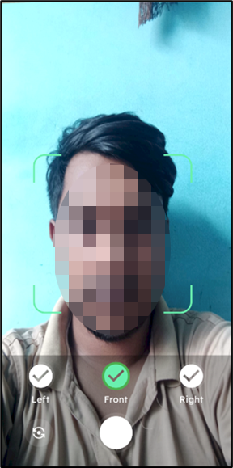
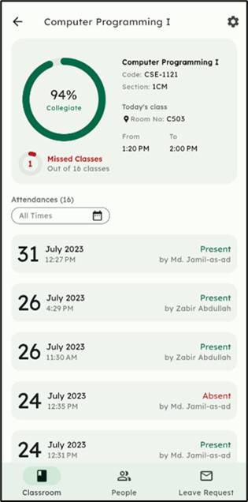

# VisoAttend

VisoAttend is a **contactless digital attendance system** that leverages **real-time face recognition** to ensure accurate, secure, and effortless attendance tracking.

It is developed using **Flutter**, **GetX**, **TensorFlow Lite with FaceNet**, **Google ML Kit**, and **Firebase** to deliver a seamless user experience.

---

## 📌 Table of Contents

- [Tech Stack](#-tech-stack)  
- [Key Features](#-key-features)  
- [Application Showcase](#-application-showcase)  
- [Contact](#-contact)  
- [Contributors](#-contributors)  
- [Copyright](#-copyright)  

---

## ⚡ Tech Stack

  
  
  
  
  
  

---

## 🚀 Key Features

| Feature                        | Description                                                                                   |
|--------------------------------|-----------------------------------------------------------------------------------------------|
| **Classroom Management**        | Create and join classrooms seamlessly to organize group-based attendance tracking.            |
| **Schedule Configuration**      | Set up weekly class schedules to automate sessions and simplify class planning.               |
| **Real-Time Class Overview**    | View ongoing and upcoming classes with timing and total session details.                      |
| **Facial Recognition Attendance** | Use real-time face recognition for secure, contactless attendance marking.                  |
| **Delegated Attendance Permissions** | Temporarily or permanently assign attendance-taking rights to class representatives (CRs). |
| **Manual Attendance Entry**     | Allow owners or authorized CRs to manually record attendance when needed.                     |
| **Attendance Analytics**        | Track students’ attendance percentages with clear data visualization.                         |
| **Leave Management**            | Submit leave requests easily and track application status in real time.                       |
| **Report Generation**           | Export attendance reports in **Excel** and **PDF** formats for documentation and analysis.   |

---

## 📸 Application Showcase

#### Core Features

| Registering Face | Setting Class Weekly Schedule | Running Classes Info (Teacher) |
|----------|----------|----------|
|  |  |  |

| Attendace Using Facial Recognition | Specific Attendance Details (Teacher) | Students with Attendance(%) (Teacher)  |
|----------|----------|----------|
|  |  |  |

| Report Generation PDF (Teacher) | Archived Class View (Teacher) | Leave Request Status (Student)  |
|----------|----------|----------|
|  |  |  |

#### More Screenshots (All features are not covered here)

Click to view more Screenshots

| Login Page | Registering Face | Registering Face (complete) |
|----------|----------|----------|
|  |  |  |

| Welcome Page (New Account) | Creating New Classroom | Setting Class Weekly Schedule |
|----------|----------|----------|
|  |  |  |

| No Classes Today | Next Classes Info (Teacher) | Running Classes Info (Teacher) |
|----------|----------|----------|
|  |  |  |

| Specific Classroom Page (Teacher) | Taking Attendace Options (Teacher) | Attendace Using Facial Recognition |
|----------|----------|----------|
|  |  |  |

| Specific Attendance Details (Teacher) | Students with Attendance(%) (Teacher) | Specific Student Details (Teacher) |
|----------|----------|----------|
|  |  |  |

| Report Generation Options (Teacher) | Report Generation PDF (Teacher) | Report Generation Excel (Teacher) |
|----------|----------|----------|
|  |  |  |

| All Created & Joined Classes | Archived Classes | Archived Class View (Teacher) |
|----------|----------|----------|
|  |  |  |

| Specific Classroom Page (Student) | Apply For Leave (Student) | Leave Request Status (Student) |
|----------|----------|----------|
|  |  |  |

---

## 📬 Contact

If you have any questions, feel free to reach out:

**Author:** Riaz Uddin Emon  
📧 Email: [riaz.uddin27@gmail.com](mailto:riaz.uddin27@gmail.com)  
🌐 GitHub: [Riaz-27](https://github.com/Riaz-27)

---

## 🤝 Contributors

- [@Shahriar777](https://github.com/Shahriar777) — UI/UX Designer  
- [@nakais](https://github.com/nakais) — SQA

---

## © Copyright

**© 2023 VisoAttend | Riaz Uddin Emon. All rights reserved.**  
